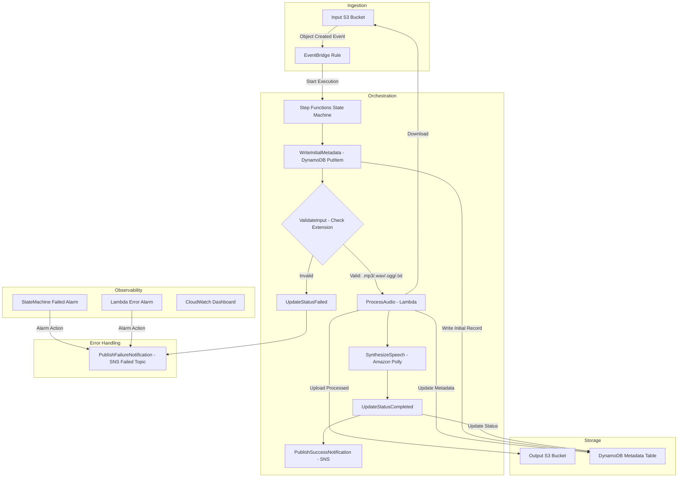
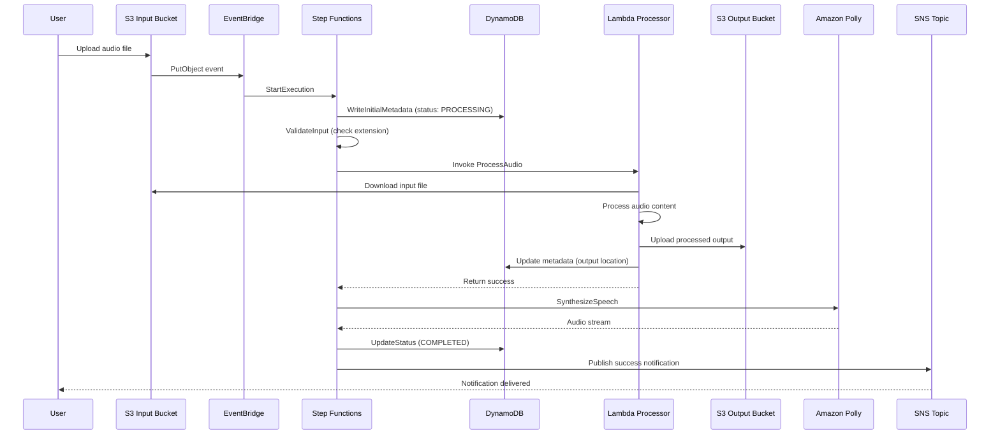
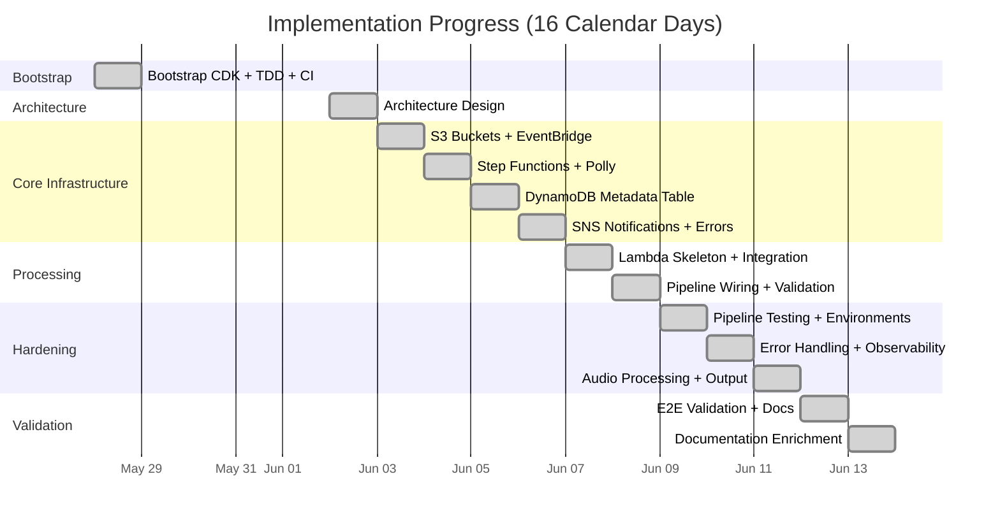
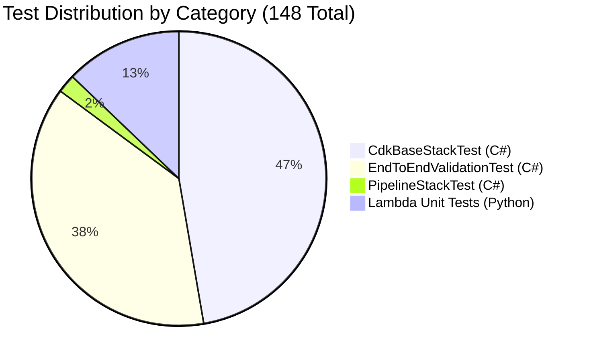

# Sleep Audio Pipeline - AWS CDK Infrastructure


<!-- Update test count when tests change -->

[](https://github.com/obstreperous-ai/cdk-sleep-csharp-kiro/actions/workflows/ci.yml)

An event-driven serverless pipeline for processing sleep audio recordings, built with AWS CDK in C# (.NET 8). This project is a **TDD Infrastructure-as-Code experiment** demonstrating how to build production-grade cloud infrastructure incrementally through pure issue-driven development with AI-assisted agents.

The system ingests audio files via S3, orchestrates processing through Step Functions, synthesizes speech with Amazon Polly, stores metadata in DynamoDB, and notifies subscribers via SNS. Every infrastructure resource was defined test-first using CDK Assertions, validated by 148 automated tests across 4 test suites.

---

## Experiment Matrix

> **This is 1 of 15 repositories** in the [obstreperous-ai](https://github.com/obstreperous-ai) experiment matrix.
>
> The matrix spans **5 programming languages** (C#, TypeScript, Python, Go, Java) and **3 AI agents**, producing 15 independent implementations of the same serverless pipeline. Each repo receives identical infrastructure challenges adapted for language idioms, enabling cross-comparison of code quality, TDD discipline, and agent autonomy.
>
> **This repo:** C# (.NET 8) + **Kiro**
>
> Explore the full matrix at [github.com/obstreperous-ai](https://github.com/obstreperous-ai).

---

## Table of Contents

- [Experiment Matrix](#experiment-matrix)
- [Architecture Overview](#architecture-overview)
- [Experiment Methodology](#experiment-methodology)
- [Experiment Results & Self-Evaluation](#experiment-results--self-evaluation)
- [Meta-Prompting and Agent Guidelines](#meta-prompting-and-agent-guidelines)
- [Test Coverage](#test-coverage)
- [Prerequisites](#prerequisites)
- [Getting Started](#getting-started)
- [Deployment](#deployment)
- [Usage](#usage)
- [Environment Configuration](#environment-configuration)
- [Running Tests](#running-tests)
- [Project Structure](#project-structure)
- [Troubleshooting](#troubleshooting)
- [Known Limitations](#known-limitations)
- [Documentation](#documentation)
- [Contributing](#contributing)
- [License](#license)

---

## Architecture Overview

The Sleep Audio Pipeline is a fully serverless system that processes uploaded audio files (or text scripts for TTS) through a multi-step orchestration workflow. For the complete architecture reference, see [docs/ARCHITECTURE.md](docs/ARCHITECTURE.md).



### Key Components

| Service | Purpose |
|---------|---------|
| **S3 (Input)** | Receives raw audio uploads; triggers EventBridge on object creation |
| **S3 (Output)** | Stores processed audio files with versioning |
| **EventBridge** | Routes S3 events to Step Functions state machine |
| **Step Functions** | Orchestrates the processing workflow with retry and error handling |
| **Lambda (Python 3.12)** | Downloads input, processes content, uploads output, updates metadata |
| **Amazon Polly** | Text-to-speech synthesis (AWS SDK integration) |
| **DynamoDB** | Metadata table tracking processing lifecycle (on-demand billing) |
| **SNS** | Success and failure notification topics (KMS encrypted) |
| **CloudWatch** | Alarms, dashboard, execution logs (14-day retention), X-Ray tracing |

### Processing Sequence (Happy Path)



---

## Experiment Methodology

This project was built as an experiment in **agentic TDD infrastructure development**. The goal was to demonstrate that production-quality serverless infrastructure can be constructed entirely through AI-assisted, issue-driven TDD. For the full experimental design, methodology, issue history, and observations, see [docs/EXPERIMENT.md](docs/EXPERIMENT.md).

The approach demonstrates that production-quality serverless infrastructure can be constructed entirely through:

### Pure Issue-Driven Development

The entire pipeline was built incrementally across **12 implementation issues**, each adding one well-defined architectural layer. Issues were structured with explicit acceptance criteria and success metrics, enabling AI agents to implement them independently without ambiguity.

### Strict TDD (Red-Green-Refactor)

Every infrastructure resource follows the Red-Green-Refactor cycle:

1. **Red** - Write failing tests describing the expected CloudFormation resources using CDK Assertions
2. **Green** - Implement the minimum CDK code to make the tests pass
3. **Refactor** - Clean up while keeping all tests green

This ensures every resource is testable without AWS deployment, providing millisecond feedback loops.

### AI-Assisted Development

AI agents implemented features following documented architecture and guidelines:

- **Architecture as Source of Truth** - [ARCHITECTURE.md](docs/ARCHITECTURE.md) defined the target state before any code was written
- **Agent Guidelines** - [AGENT_GUIDELINES.md](docs/AGENT_GUIDELINES.md) provided consistent development patterns and conventions
- **Context Propagation** - Task files tracked findings and environment quirks across sessions
- **Feature Files** - Explicit acceptance criteria guided implementation scope

### Key Takeaways

1. TDD for infrastructure provides high confidence in changes without deployment
2. CDK Assertions catch IAM permission, encryption, and configuration issues early
3. Step Functions SDK integrations reduce Lambda count and operational complexity
4. Event-driven patterns naturally separate concerns and enable independent testing
5. Maintaining architecture documentation alongside code prevents drift

---

## Experiment Results & Self-Evaluation

This project completed its full implementation scope: 12 issues merged with **zero rework** across 16 calendar days, producing 148 automated tests covering 25+ AWS resources. The following scores are self-assessed based on objective criteria documented in [FINAL-REPORT.md](FINAL-REPORT.md).

### Scores

| Category | Score | Notes |
|----------|-------|-------|
| **Overall** | **8.5 / 10** | Viable and productive methodology; deferred items are scope boundaries, not quality failures |
| Code Quality | 8 / 10 | Clean, well-documented, appropriately organized; tuple complexity noted |
| Test Quality | 8.5 / 10 | Comprehensive TDD patterns; 6:1 test-to-resource ratio |
| TDD Discipline | 9 / 10 | Strong Red-Green-Refactor adherence; Issue #12 batch addition is only deviation |
| Documentation | 8.5 / 10 | Architecture doc is a standout artifact; 6 documentation pages |
| Architecture Fidelity | 9 / 10 | Core pipeline fully implemented; deferred items explicitly marked as future |

### What the Experiment Demonstrated

The project validates that AI-assisted, issue-driven TDD can produce well-structured, well-tested infrastructure with minimal human intervention. Structured issues with explicit acceptance criteria eliminated ambiguity and enabled zero-rework PRs. Architecture-first documentation provided guardrails that kept 12 independent PRs architecturally coherent without manual correction.

For the complete analysis including limitations, technical debt, and cross-language comparison framework, see [FINAL-REPORT.md](FINAL-REPORT.md).

> **Readers are invited to draw their own conclusions.** This is one data point in a 15-repo experiment. Compare implementations across agents and languages at [github.com/obstreperous-ai](https://github.com/obstreperous-ai) to form a fuller picture.

### Issue Timeline



---

## Meta-Prompting and Agent Guidelines

This project includes reusable patterns for bootstrapping agentic TDD IaC projects. The patterns were extracted from the development process and can be applied to any CDK project using AI-assisted development.

### Included Pattern Library

| Pattern | Description |
|---------|-------------|
| Agent Instruction Template | How to structure guidelines for AI agents working on CDK projects |
| Issue-Driven Development | Structuring issues for agent consumption with clear acceptance criteria |
| TDD Infrastructure Pattern | Red/Green/Refactor applied to CDK Assertions with C# examples |
| Architecture-First Development | Maintaining docs as the authoritative source of truth |
| Context Propagation | Using task files to maintain agent state across sessions |
| Error Handling and Observability | Step Functions retry/catch patterns with CDK code |

See the full reference: **[docs/META-PROMPTS.md](docs/META-PROMPTS.md)**

For development workflow conventions and coding standards, see [docs/AGENT_GUIDELINES.md](docs/AGENT_GUIDELINES.md).

---

## Prerequisites

- [.NET 8 SDK](https://dotnet.microsoft.com/download/dotnet/8.0) (or .NET 9 with RollForward)
- [Node.js 20+](https://nodejs.org/)
- [AWS CDK CLI](https://docs.aws.amazon.com/cdk/v2/guide/cli.html) (`npm install -g aws-cdk`)
- [Python 3.12](https://www.python.org/downloads/) (for Lambda development and testing)
- AWS account with configured credentials (for deployment)

---

## Getting Started

```bash
# Clone the repository
git clone https://github.com/obstreperous-ai/cdk-sleep-csharp-kiro.git
cd cdk-sleep-csharp-kiro

# Restore NuGet packages
dotnet restore src/CdkBase.sln

# Build the solution
dotnet build src/CdkBase.sln

# Run all tests (C# infrastructure tests)
dotnet test src/CdkBase.sln --verbosity normal

# Synthesize CloudFormation template (default: dev environment)
npx cdk synth

# Synthesize for a specific environment
npx cdk synth -c environment=dev
npx cdk synth -c environment=prod
```

> **Note:** In some sandbox environments, you may need to run `unset NODE_OPTIONS` before `dotnet` or `npx` commands. See [Troubleshooting](#troubleshooting) for details.

---

## Deployment

### Bootstrap (first-time only)

```bash
# Bootstrap CDK in your AWS account/region
cdk bootstrap aws://ACCOUNT_ID/REGION
```

### Deploy

```bash
# Deploy with default (dev) configuration
cdk deploy

# Deploy to a specific environment
cdk deploy -c environment=dev
cdk deploy -c environment=staging
cdk deploy -c environment=prod

# Preview changes before deployment
cdk diff
cdk diff -c environment=prod
```

### CI/CD Pipeline

The project includes a `PipelineStack` (CDK Pipelines) for automated deployment:
- Sources from GitHub via CodeStar Connections
- Self-mutating pipeline that updates itself on changes
- Builds .NET solution, synthesizes CDK, and deploys the stack

The GitHub Actions CI workflow (`.github/workflows/ci.yml`) runs on every push to `main` and on all pull requests:

1. Setup .NET 8, Node.js 20, CDK CLI
2. Restore, Build, Test
3. CDK Synth for default, dev, and prod environments
4. Advisory CDK Diff (non-blocking)

---

## Usage

### Uploading Audio Files

Upload a supported file to the input S3 bucket to trigger the pipeline:

```bash
# Upload an audio file
aws s3 cp my-sleep-audio.mp3 s3://<input-bucket-name>/

# Upload a text file for speech synthesis
aws s3 cp sleep-script.txt s3://<input-bucket-name>/
```

**Supported formats:** `.mp3`, `.wav`, `.ogg`, `.txt`

### Checking Processing Status

Query the DynamoDB metadata table for processing status:

```bash
aws dynamodb get-item \
  --table-name <metadata-table-name> \
  --key '{"audioId": {"S": "my-sleep-audio.mp3"}}'
```

**Status values:** `PROCESSING` -> `COMPLETED` (or `FAILED`)

### Viewing Notifications

Subscribe to SNS topics for real-time notifications:

```bash
# Subscribe to success notifications
aws sns subscribe \
  --topic-arn <completed-topic-arn> \
  --protocol email \
  --notification-endpoint your@email.com

# Subscribe to failure notifications
aws sns subscribe \
  --topic-arn <failed-topic-arn> \
  --protocol email \
  --notification-endpoint your@email.com
```

### Monitoring

- **CloudWatch Dashboard**: View state machine executions and Lambda performance metrics
- **CloudWatch Alarms**: Automatic alerts on state machine failures or Lambda errors
- **X-Ray**: End-to-end distributed tracing across the pipeline
- **Step Functions Console**: Visual execution history and state transitions

---

## Environment Configuration

The project supports multiple environments via CDK context:

```bash
cdk synth -c environment=dev      # Development (default)
cdk synth -c environment=staging  # Staging
cdk synth -c environment=prod     # Production
```

| Configuration | Dev | Staging | Production |
|---------------|-----|---------|------------|
| Log Retention | 14 days | 30 days | 90 days |
| S3 Versioning | Enabled | Enabled | Enabled |
| DynamoDB Mode | On-demand | On-demand | On-demand |
| KMS Encryption | SSE-KMS | SSE-KMS | SSE-KMS |
| PITR Recovery | Enabled | Enabled | Enabled |

All environments include full security defaults: KMS encryption on S3/DynamoDB/SNS, public access blocked, least-privilege IAM.

---

## Running Tests

### C# Infrastructure Tests

```bash
# Run all tests
dotnet test src/CdkBase.sln --verbosity normal

# Run specific test classes
dotnet test src/CdkBase.sln --filter "FullyQualifiedName~CdkBaseStackTest"
dotnet test src/CdkBase.sln --filter "FullyQualifiedName~EndToEndValidationTest"
dotnet test src/CdkBase.sln --filter "FullyQualifiedName~PipelineStackTest"
```

### Python Lambda Unit Tests

```bash
cd src/CdkBase/lambda/process_audio
python -m pytest test_index.py -v
# or
python -m unittest test_index -v
```

### Test Coverage

The project has **148 total tests** across two runtimes: 129 C# infrastructure tests (run via `dotnet test`) and 19 Python Lambda tests (run separately via `pytest`).

| Test Class | Count | Scope |
|------------|-------|-------|
| **CdkBaseStackTest** | 70 | Individual resource verification (S3, DynamoDB, Lambda, Step Functions, alarms, dashboard) |
| **EndToEndValidationTest** | 56 | Full pipeline flow validation (happy path, error paths, retry policies, permissions) |
| **PipelineStackTest** | 3 | CI/CD pipeline configuration |
| **Python tests** (separate) | 19 | Lambda handler logic (validation, processing, error handling) |
| **Total** | **148** | 129 C# + 19 Python |

### Test Distribution



---

## Project Structure

```
.
├── src/
│   ├── CdkBase.sln                      # .NET solution file
│   ├── CdkBase/                         # CDK application
│   │   ├── Program.cs                   # CDK app entry point (environment config)
│   │   ├── CdkBaseStack.cs             # Main infrastructure stack (all resources)
│   │   ├── PipelineStack.cs            # CI/CD pipeline stack (CodePipeline)
│   │   ├── CdkBase.csproj             # Project file (.NET 8, CDK packages)
│   │   └── lambda/
│   │       └── process_audio/
│   │           ├── index.py            # Lambda handler (Python 3.12)
│   │           └── test_index.py       # Lambda unit tests (19 tests)
│   └── CdkBase.Tests/                  # xUnit test project
│       ├── CdkBaseStackTest.cs         # Stack resource tests (70 tests)
│       ├── EndToEndValidationTest.cs   # End-to-end validation tests (56 tests)
│       ├── PipelineStackTest.cs        # Pipeline tests (3 tests)
│       └── CdkBase.Tests.csproj       # Test project file
├── docs/
│   ├── ARCHITECTURE.md                 # Detailed architecture documentation
│   ├── AGENT_GUIDELINES.md            # Development workflow and conventions
│   ├── SUMMARY.md                     # Project summary and key decisions
│   └── META-PROMPTS.md               # Reusable agentic TDD IaC patterns
├── .github/
│   └── workflows/
│       └── ci.yml                     # GitHub Actions CI workflow
├── cdk.json                           # CDK configuration and context
├── LICENSE                            # Apache 2.0 License
└── README.md                          # This file
```

---

## Troubleshooting

### Common Issues

**CDK Synth fails with NODE_OPTIONS error**
```bash
# Unset NODE_OPTIONS before running CDK commands
unset NODE_OPTIONS
npx cdk synth
```

**Tests fail with JSII runtime errors**

The test project includes `xunit.runner.json` which disables parallel test execution (`parallelizeTestCollections: false`, `maxParallelThreads: 1`) to prevent JSII runtime resource conflicts. If you still encounter issues under heavy resource pressure, run test classes individually:
```bash
dotnet test src/CdkBase.sln --filter "FullyQualifiedName~CdkBaseStackTest"
dotnet test src/CdkBase.sln --filter "FullyQualifiedName~EndToEndValidationTest"
```

**Lambda function timeout during processing**
- Check file size (maximum 100 MB input files)
- Verify S3 permissions are correctly configured
- Check CloudWatch Logs for the Lambda function

**Step Functions execution fails**
- Check CloudWatch Logs for the state machine (log level ALL)
- Review DynamoDB metadata table for error details in the `errorInfo` field
- Check the SNS Failed topic for failure notifications
- Use X-Ray traces for end-to-end visibility

**CDK Bootstrap required**
```bash
# If you see "This stack uses assets" error
cdk bootstrap aws://ACCOUNT_ID/REGION
```

### Useful Commands

```bash
# View state machine executions
aws stepfunctions list-executions --state-machine-arn <arn>

# Check Lambda logs
aws logs tail /aws/lambda/<function-name> --follow

# Query DynamoDB for failed items
aws dynamodb scan \
  --table-name <table-name> \
  --filter-expression "#s = :failed" \
  --expression-attribute-names '{"#s":"status"}' \
  --expression-attribute-values '{":failed":{"S":"FAILED"}}'
```

---

## Known Limitations

1. **Polly task uses placeholder parameters** - The SynthesizeSpeech step uses static text and voice (Joanna). Dynamic parameters from the S3 event input are not yet wired.
2. **No Bedrock AI enhancement** - The optional AI enhancement step documented in the architecture is not implemented.
3. **No CloudFront delivery** - Processed audio in the output bucket is not served through a CDN.
4. **Single-region deployment** - No cross-region replication or global table configuration.
5. **Environment-specific configuration is minimal** - All environments currently use the same resource defaults.
6. **No S3 lifecycle policies** - The architecture documents lifecycle transitions but these are not yet in CDK code.

---

## Documentation

| Document | Description |
|----------|-------------|
| [Architecture](docs/ARCHITECTURE.md) | Detailed system design, data flow, security model, and observability |
| [Agent Guidelines](docs/AGENT_GUIDELINES.md) | Development workflow, TDD practices, and coding conventions |
| [Project Summary](docs/SUMMARY.md) | Key decisions, what was built, and experiment notes |
| [Meta-Prompts](docs/META-PROMPTS.md) | Reusable agentic TDD IaC patterns and prompt templates |
| [Experiment Design](docs/EXPERIMENT.md) | Experimental methodology, issue history, and preliminary observations |

---

## Contributing

This project follows strict TDD methodology. All infrastructure changes must:

1. Start with a failing test in `src/CdkBase.Tests/`
2. Be traceable to a component in [docs/ARCHITECTURE.md](docs/ARCHITECTURE.md)
3. Pass all existing tests after implementation
4. Be verified with `npx cdk synth` for all environments

See [docs/AGENT_GUIDELINES.md](docs/AGENT_GUIDELINES.md) for complete development guidelines.

---

## License

This project is licensed under the Apache License 2.0 - see the [LICENSE](LICENSE) file for details.
