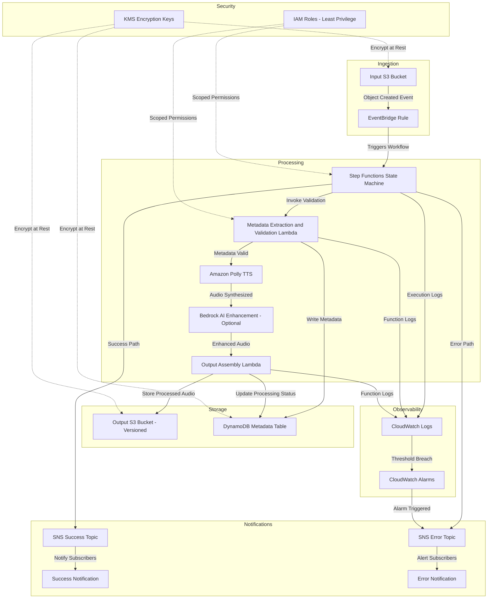

# Event-Driven Sleep Audio Pipeline - Architecture

> **Note:** This document defines the **target architecture** for the Sleep Audio Pipeline.
> Components described here are implemented incrementally via TDD. The CDK stack may not
> yet contain all resources shown below. Refer to the test suite for the current state of
> implemented infrastructure.

## High-Level Overview

The Sleep Audio Pipeline is a fully serverless, event-driven system built on AWS that ingests raw sleep audio recordings, processes them through text-to-speech synthesis and AI-enhanced audio generation, and delivers production-ready sleep audio content. The pipeline is defined as Infrastructure as Code using AWS CDK with C# (.NET 8), enabling repeatable deployments across multiple environments.

The system follows an event-driven architecture where each component reacts to events rather than being directly invoked. An audio file uploaded to the input S3 bucket triggers a chain of processing steps orchestrated by AWS Step Functions. The pipeline validates input, extracts metadata, synthesizes speech with Amazon Polly, optionally enhances content with Amazon Bedrock, stores processed output in a versioned S3 bucket, records metadata in DynamoDB, and notifies downstream consumers via SNS upon completion or failure.

This approach ensures loose coupling between components, independent scaling, fault isolation, and a clear audit trail of all processing events.

## Architecture Diagram



## Data Flow

The pipeline processes sleep audio through the following steps:

1. **Audio Upload**: A client uploads a raw sleep audio file (or text script for synthesis) to the Input S3 Bucket. Supported formats include MP3, WAV, and OGG.

2. **Event Detection**: Amazon S3 emits an object-created event that is captured by an EventBridge rule. The rule matches events based on the bucket name and object key prefix, filtering for valid audio pipeline inputs.

3. **Workflow Initiation**: EventBridge triggers the Step Functions state machine, passing the S3 object key and metadata as input. The state machine begins orchestrating the multi-step processing workflow.

4. **Metadata Extraction and Validation**: The first Lambda function validates the uploaded file. It checks file format, size constraints, and extracts metadata such as duration, encoding, and sample rate. Validation results and metadata are written to the DynamoDB metadata table. If validation fails, the workflow transitions to the error path.

5. **Text-to-Speech Synthesis**: Amazon Polly converts text scripts into natural-sounding speech audio. The service supports multiple voices, languages, and neural TTS engines optimized for long-form sleep content. Output is streamed directly to the processing pipeline.

6. **AI Enhancement (Optional)**: When enabled, Amazon Bedrock applies generative AI models to enhance the audio content. This can include generating ambient soundscapes, adapting pacing for sleep optimization, or creating personalized audio variations based on user preferences.

7. **Output Assembly**: A final Lambda function assembles the processed audio, applies any post-processing (normalization, format conversion), and writes the result to the Output S3 Bucket with versioning enabled. The DynamoDB metadata table is updated with the final processing status, output location, and timestamps.

8. **Success Notification**: Upon successful completion, the Step Functions state machine publishes a message to the SNS Success Topic. Subscribers (downstream services, monitoring dashboards, or user-facing APIs) receive notification that new content is available.

9. **Error Handling**: If any step fails after retries are exhausted, the state machine transitions to the error path and publishes to the SNS Error Topic. The error notification includes the failure reason, the step that failed, and the original input reference for debugging.

## AWS Services

| Service | Role | Rationale |
|---------|------|-----------|
| **Amazon S3 (Input)** | Ingestion bucket for raw audio uploads | Highly durable object storage with native event notifications; supports any file size and format |
| **Amazon S3 (Output)** | Versioned storage for processed audio | Versioning preserves processing history; lifecycle policies manage cost over time |
| **Amazon EventBridge** | Event routing and filtering | Decouples ingestion from processing; supports content-based filtering and multiple targets without code changes |
| **AWS Step Functions** | Workflow orchestration | Visual workflow definition with built-in retry, error handling, and parallel execution; integrates natively with all AWS services |
| **AWS Lambda** | Serverless compute for validation and assembly | Pay-per-invocation; scales to zero; ideal for short-lived processing tasks under 15 minutes |
| **Amazon Polly** | Text-to-speech synthesis | Neural TTS with natural-sounding voices optimized for long-form content; supports SSML for fine-grained control |
| **Amazon Bedrock** | Generative AI for content enhancement | Managed foundation models without infrastructure; enables personalization and creative audio generation |
| **Amazon DynamoDB** | Metadata storage and query | Single-digit millisecond latency; on-demand capacity mode eliminates capacity planning; single-table design for efficient access |
| **Amazon SNS** | Event notifications (success and error) | Fan-out to multiple subscribers; supports email, SMS, HTTP, Lambda, and SQS endpoints |
| **Amazon CloudWatch** | Logging and monitoring | Centralized logs from all Lambda functions and Step Functions executions; metric-based alarms for automated alerting |
| **AWS IAM** | Access control | Fine-grained, least-privilege policies ensure each component only accesses the resources it needs |
| **AWS KMS** | Encryption key management | Customer-managed keys for encryption at rest across S3, DynamoDB, and SNS; key rotation and audit trail |

## Security

### Least-Privilege IAM Roles

Each component in the pipeline operates with its own IAM role scoped to the minimum permissions required:

- The validation Lambda can read from the Input S3 Bucket and write to DynamoDB, but cannot access the Output S3 Bucket.
- The output assembly Lambda can write to the Output S3 Bucket and update DynamoDB, but cannot read from the Input S3 Bucket after processing.
- Step Functions has permission to invoke its specific Lambda functions and publish to SNS topics, but no broader access.
- EventBridge rules can only start the designated Step Functions state machine.

### Encryption at Rest

All data stores use encryption at rest via AWS KMS:

- **S3 Buckets**: Server-side encryption with customer-managed KMS keys (SSE-KMS) for both input and output buckets.
- **DynamoDB Table**: Encryption at rest using a customer-managed KMS key, providing full control over key rotation and access policies.
- **SNS Topics**: Message encryption using KMS keys to protect notification payloads.

### Private Buckets

Both the input and output S3 buckets are configured with:

- Public access blocked at the account and bucket level (BlockPublicAccess set to BLOCK_ALL).
- No bucket policies granting anonymous access.
- Access restricted to IAM principals within the same account.
- SSL/TLS enforced for all API calls via bucket policy conditions.

### VPC Considerations

While the current serverless architecture does not require VPC placement (S3, DynamoDB, and other services are accessed via public endpoints), the design supports future VPC integration:

- Lambda functions can be placed in private subnets with VPC endpoints for S3 and DynamoDB.
- Interface VPC endpoints can be provisioned for Step Functions, KMS, and CloudWatch.
- Security groups restrict network access to only required service endpoints.

## Observability

### CloudWatch Logs

All compute components emit structured logs to CloudWatch Logs:

- **Lambda Functions**: Each function has a dedicated log group with configurable retention (14 days for dev, 90 days for production). Logs include request IDs, input parameters, processing duration, and outcomes.
- **Step Functions**: Execution history is logged at the EXPRESS level, capturing state transitions, input/output for each step, and error details.
- **Structured Format**: Logs use JSON format for easy querying with CloudWatch Logs Insights.

### CloudWatch Alarms

Alarms monitor critical pipeline health metrics:

- **Step Functions Failures**: Alarm triggers when execution failure rate exceeds threshold (e.g., more than 5% failures in 5 minutes).
- **Lambda Errors**: Alarm on invocation errors or throttling for any processing Lambda.
- **Lambda Duration**: Alarm when function duration approaches timeout, indicating potential performance degradation.
- **DynamoDB Throttling**: Alarm on read/write throttle events indicating capacity issues.

### SNS Notifications

The notification system provides two paths:

- **Success Topic**: Notifies downstream consumers when audio processing completes. Includes the output S3 key, metadata reference, and processing duration.
- **Error Topic**: Alerts operations teams and error-handling systems when processing fails. Includes error type, failed step, input reference, and stack trace when available. CloudWatch Alarms also route to this topic.

### X-Ray Tracing

AWS X-Ray tracing is enabled across the pipeline for end-to-end request tracking:

- Traces follow a request from the EventBridge trigger through Step Functions, Lambda invocations, and service calls.
- Service maps visualize latency and error rates across components.
- Annotations and metadata on traces enable filtering by audio format, file size, or processing path.

## Cost Considerations

### Pay-Per-Use Model

The fully serverless architecture ensures costs scale linearly with usage:

- **Lambda**: Billed per invocation and GB-second of compute. No cost when idle.
- **Step Functions**: Billed per state transition. Standard workflows for complex orchestration; Express workflows available for high-volume, short-duration executions.
- **S3**: Storage costs based on data volume; request costs per operation.
- **DynamoDB**: On-demand mode charges per read/write request with no minimum.

### S3 Lifecycle Policies

Cost optimization through automated data management:

- Raw input files transition to S3 Infrequent Access after 30 days.
- Input files are deleted after 90 days (originals are no longer needed after processing).
- Output bucket retains current versions indefinitely; non-current versions expire after 60 days.
- Incomplete multipart uploads are cleaned up after 7 days.

### DynamoDB On-Demand Capacity

On-demand capacity mode is selected because:

- Pipeline traffic is bursty (uploads may cluster around certain times).
- No need to predict read/write capacity units in advance.
- Automatically scales to handle spikes without throttling.
- Cost-effective for workloads with unpredictable or variable traffic patterns.

### Lambda Optimization

Lambda functions are tuned for cost and performance:

- Memory allocation is right-sized based on profiling (validation functions need less memory than audio processing).
- Timeout values are set to realistic maximums, preventing runaway executions.
- ARM64 (Graviton2) architecture provides better price-performance for compute-intensive tasks.
- Provisioned concurrency is avoided unless latency SLAs require it.

## Multi-Environment Support

### CDK Context-Based Configuration

The CDK app uses context values to configure environment-specific settings:

```
cdk deploy -c environment=dev
cdk deploy -c environment=staging
cdk deploy -c environment=prod
```

### Environment Differences

| Configuration | Dev | Staging | Production |
|---------------|-----|---------|------------|
| Log Retention | 7 days | 30 days | 90 days |
| Alarm Actions | Suppressed | Email | PagerDuty + Email |
| S3 Versioning | Disabled | Enabled | Enabled |
| DynamoDB Backups | Disabled | Daily | Continuous (PITR) |
| KMS Key Rotation | Disabled | Enabled | Enabled |
| Lambda Concurrency | Unreserved | 50 | 200 |
| SNS Subscriptions | Dev email | Team email | Ops channel + PagerDuty |

### Resource Naming

Resources include the environment name as a prefix or suffix to prevent naming collisions and enable multi-environment deployments within a single AWS account:

- `sleeppipeline-dev-input-bucket`
- `sleeppipeline-prod-metadata-table`
- `sleeppipeline-staging-processing-workflow`

## Future Extensibility

The event-driven architecture supports extension without modifying existing components:

- **Real-Time Streaming**: Add Kinesis Data Streams for real-time audio ingestion from IoT sleep devices, feeding into the same processing pipeline via EventBridge.
- **Additional AI Models**: Integrate new Amazon Bedrock foundation models for advanced audio analysis, sentiment detection, or personalized content generation without changing the orchestration layer.
- **User Preference APIs**: Add API Gateway and Lambda endpoints for users to configure preferences (voice selection, ambient sounds, duration), stored in DynamoDB and consumed by the processing pipeline.
- **Analytics Dashboards**: Subscribe additional consumers to EventBridge events for real-time analytics. Use Kinesis Data Firehose to deliver event data to S3 for batch analytics with Athena.
- **Multi-Region Deployment**: S3 Cross-Region Replication and DynamoDB Global Tables enable active-active multi-region deployments for lower latency and disaster recovery.
- **Content Delivery**: Add CloudFront distributions in front of the Output S3 Bucket for low-latency global delivery of processed sleep audio to end users.

## TDD Approach

This project follows a Test-Driven Development (TDD) methodology using CDK Assertions to verify infrastructure before deployment.

### Red-Green-Refactor Cycle

1. **Red**: Write a failing test that describes the desired infrastructure resource or behavior. The test asserts the expected CloudFormation resource properties.
2. **Green**: Implement the minimum CDK construct code to make the test pass. Only add what the test requires.
3. **Refactor**: Improve the CDK code structure (extract constructs, consolidate patterns) while keeping all tests green. Run the full test suite after each refactor.

### CDK Assertions

Tests use `Amazon.CDK.Assertions` (included in `Amazon.CDK.Lib`) to verify synthesized CloudFormation templates:

- `Template.FromStack()` - synthesize a stack into a testable template
- `template.HasResourceProperties()` - verify a resource exists with specific properties
- `template.ResourceCountIs()` - verify the expected count of a resource type
- `template.HasOutput()` - verify stack outputs are defined correctly

### Example Test Pattern (Planned)

The following is an example of a test that will pass once the input S3 bucket is implemented
in the CDK stack. It illustrates the pattern used to verify resource properties via CDK Assertions:

```csharp
[Fact]
public void Stack_HasInputBucketWithEncryption()
{
    var app = new App();
    var stack = new CdkBaseStack(app, "TestStack");
    var template = Template.FromStack(stack);

    template.HasResourceProperties("AWS::S3::Bucket", new Dictionary<string, object>
    {
        { "BucketEncryption", new Dictionary<string, object>
            {
                { "ServerSideEncryptionConfiguration", Match.AnyValue() }
            }
        }
    });
}
```

### Benefits of TDD for Infrastructure

- **Confidence in Changes**: Tests catch unintended modifications to security policies, resource configurations, and IAM permissions before deployment.
- **Living Documentation**: Tests describe the expected infrastructure state, serving as executable documentation.
- **Safe Refactoring**: Extract constructs and reorganize code knowing that tests verify the synthesized output remains correct.
- **Fast Feedback**: Tests run in milliseconds against the synthesized template without requiring AWS credentials or actual deployments.
