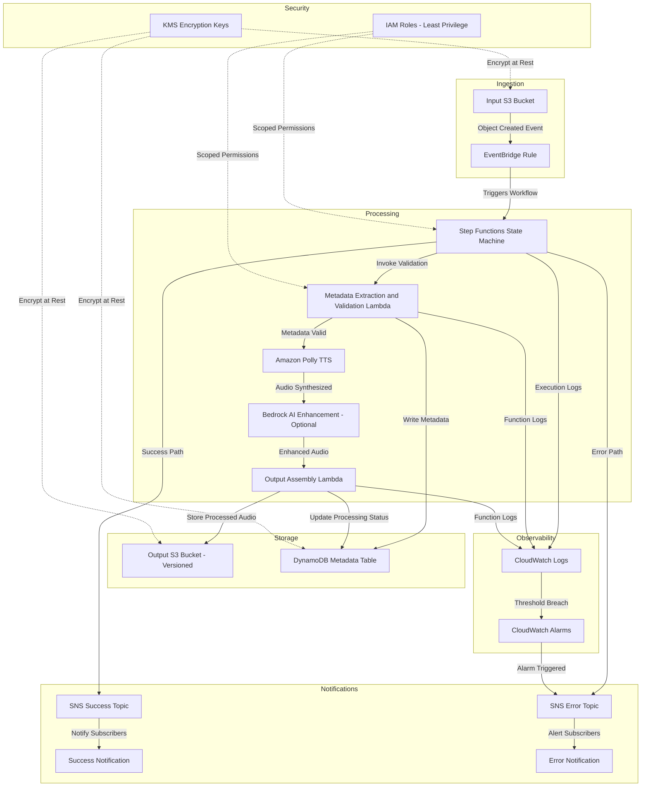
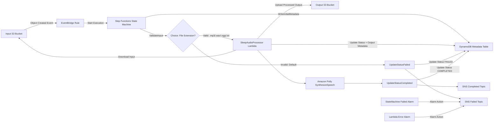
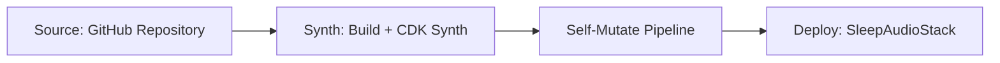
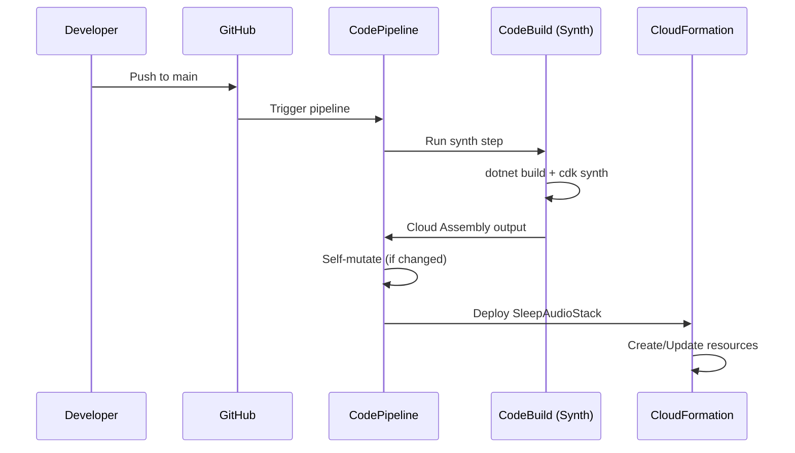
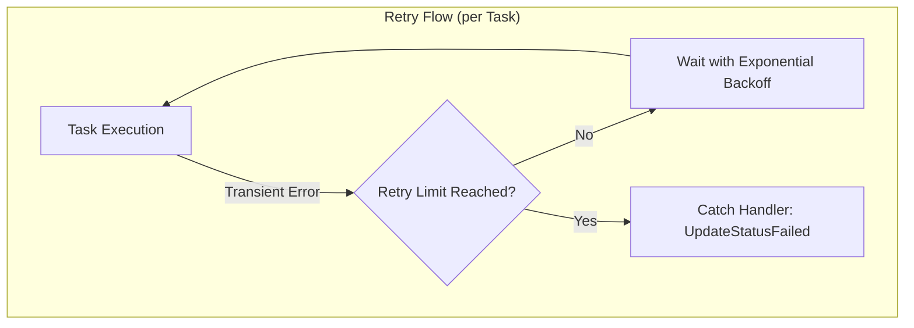
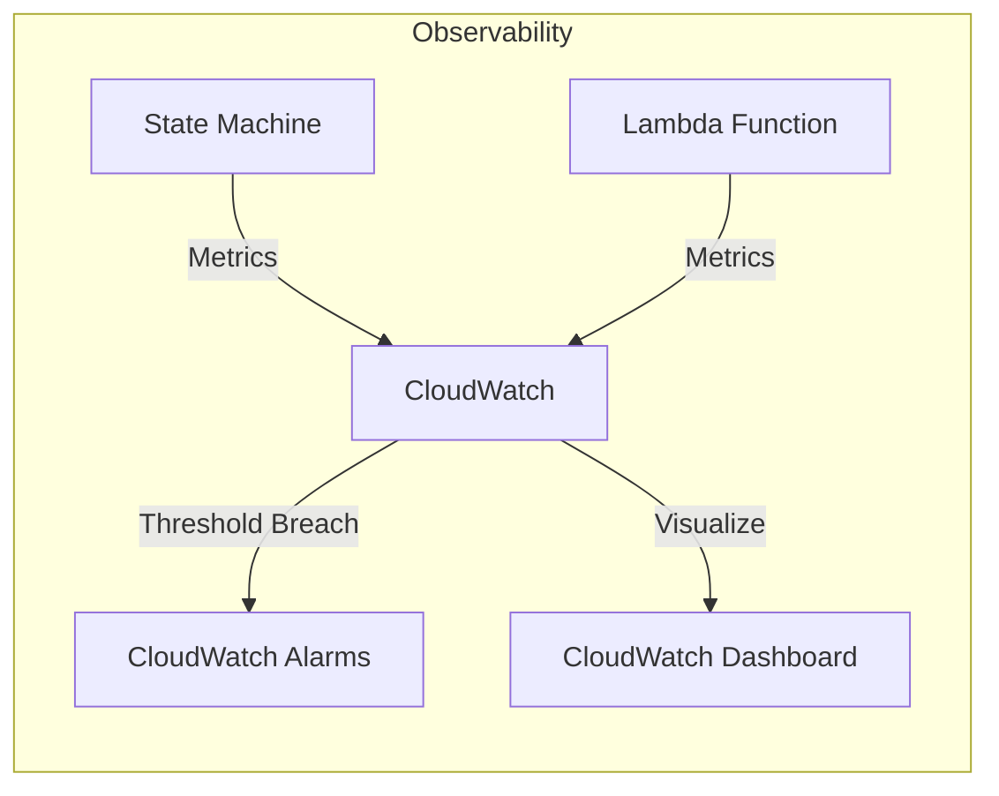

# Event-Driven Sleep Audio Pipeline - Architecture

> **Note:** This document defines the architecture for the Sleep Audio Pipeline.
> The core pipeline infrastructure has been fully implemented and validated through
> comprehensive TDD tests. Optional future enhancements (Bedrock AI, CloudFront) are
> noted in the Future Extensibility section.

## High-Level Overview

The Sleep Audio Pipeline is a fully serverless, event-driven system built on AWS that ingests raw sleep audio recordings, processes them through text-to-speech synthesis and AI-enhanced audio generation, and delivers production-ready sleep audio content. The pipeline is defined as Infrastructure as Code using AWS CDK with C# (.NET 8), enabling repeatable deployments across multiple environments.

The system follows an event-driven architecture where each component reacts to events rather than being directly invoked. An audio file uploaded to the input S3 bucket triggers a chain of processing steps orchestrated by AWS Step Functions. The pipeline validates input, extracts metadata, synthesizes speech with Amazon Polly, optionally enhances content with Amazon Bedrock, stores processed output in a versioned S3 bucket, records metadata in DynamoDB, and notifies downstream consumers via SNS upon completion or failure.

This approach ensures loose coupling between components, independent scaling, fault isolation, and a clear audit trail of all processing events.

## Architecture Diagram



## Current Implementation Status

The following components from the target architecture have been implemented in the CDK stack:

- **Input S3 Bucket (SleepAudioInputBucket)**: Configured with KMS-managed server-side encryption (SSE-KMS), versioning enabled, EventBridge integration enabled (events forwarded to EventBridge; the rule filters for object-created events), and all public access blocked (BlockPublicAccess.BLOCK_ALL). RemovalPolicy is set to DESTROY for non-production use.

- **Output S3 Bucket (SleepAudioOutputBucket)**: Configured with KMS-managed server-side encryption (SSE-KMS), versioning enabled, and all public access blocked. RemovalPolicy is set to DESTROY for non-production use.

- **EventBridge Rule (AudioUploadRule)**: Triggers on "Object Created" events from the input bucket (source: `aws.s3`, detail-type: `Object Created`, filtered by input bucket name). Targets the Step Functions state machine to start execution, passing the S3 event as input.

- **Step Functions State Machine (SleepAudioPipelineStateMachine)**: Orchestrates the sleep audio processing pipeline. Contains a chain of DynamoDB PutItem (write initial metadata), a ValidateInput Choice state (check file extension), LambdaInvoke (process audio metadata with input validation), Polly SynthesizeSpeech, DynamoDB UpdateItem (mark completed), and SNS Publish (notify completion) tasks. The ValidateInput Choice state rejects unsupported file types before Lambda invocation. Error handling catches failures on all Task states, updates status to FAILED with error details, and publishes failure notification via SNS. Logging enabled (CloudWatch Logs, level ALL). Tracing enabled (X-Ray).

- **Amazon Polly Integration (SynthesizeSpeech task)**: AWS SDK integration task within the state machine that invokes polly:synthesizeSpeech. Configured with placeholder parameters (text, voice Joanna, output mp3). Will be enhanced with dynamic parameters from S3 event input in future iterations.

- **DynamoDB Metadata Table (SleepAudioMetadataTable)**: Stores processing metadata for each audio file. Partition key `audioId` (String). On-demand billing (PAY_PER_REQUEST). AWS-managed encryption enabled. Point-in-time recovery enabled for data protection. RemovalPolicy set to DESTROY for non-production use.

- **State Machine DynamoDB Integration**: The state machine includes DynamoDB PutItem and UpdateItem tasks for metadata tracking. Processing flow: writes initial record with status PROCESSING, invokes SleepAudioProcessor Lambda, executes Polly synthesis, then updates status to COMPLETED. On failure, a catch handler updates status to FAILED and stores error details in the `errorInfo` field. Fields tracked include audioId, inputBucket, inputKey, createdAt, updatedAt, status, and errorInfo (on failure).

- **ValidateInput Choice State**: A Step Functions Choice state positioned between WriteInitialMetadata and ProcessAudio that validates the uploaded file extension. Checks `$.detail.object.key` using StringMatches conditions for supported formats (`.mp3`, `.wav`, `.ogg`, `.txt`). Valid extensions route to ProcessAudio; invalid extensions (Default path) route to UpdateStatusFailed -> PublishFailureNotification.

- **SleepAudioProcessor Lambda Function (SleepAudioProcessorFunction)**: Python 3.12 Lambda function that performs the core audio processing between input validation and Polly synthesis. Implements the full processing pipeline: downloads input from the Input S3 Bucket, processes content (text preparation for TTS or audio pass-through with metadata enrichment), uploads processed output to the Output S3 Bucket with a structured naming convention (`processed/{baseKey}_{timestamp}_{uuid}.mp3`), and updates the DynamoDB metadata record with output location, file size, and processing metadata. Performs two-layer input validation: verifies required fields (`detail.bucket.name`, `detail.object.key`), checks file extension against supported formats, and validates bucket name matches the expected input bucket. Configured with a 30-second timeout and environment variables `TABLE_NAME` (DynamoDB metadata table), `INPUT_BUCKET_NAME` (expected source bucket for validation), and `OUTPUT_BUCKET_NAME` (destination bucket for processed output). Granted DynamoDB read/write permissions via `metadataTable.GrantReadWriteData`, S3 read permissions on the input bucket via `inputBucket.GrantRead`, and S3 write permissions on the output bucket via `outputBucket.GrantWrite`. The state machine invokes this function using a LambdaInvoke task with error handling (Catch for `States.ALL` routing to `UpdateStatusFailed`). Returns a structured response including audioId, outputBucket, outputKey, status, fileSize, and processing metadata for use by downstream state machine steps.

- **SNS Completed Topic (SleepAudioPipelineCompleted)**: Encrypted with AWS-managed SNS KMS key (alias/aws/sns). Receives notification when pipeline processing completes successfully. Message includes audioId, status, and timestamp.

- **SNS Failed Topic (SleepAudioPipelineFailed)**: Encrypted with AWS-managed SNS KMS key (alias/aws/sns). Receives notification when pipeline processing fails. Message includes audioId, status, error details, and timestamp.

- **SNS Notification Integration**: The state machine publishes to SNS topics as the final step in both success and failure paths. Success path publishes to Completed topic after DynamoDB status update. Failure path publishes to Failed topic after DynamoDB error status update.

- **CloudWatch Alarms**: Two alarms monitor pipeline health and route to the SNS Failed Topic as alarm actions:
  - *StateMachineExecutionFailedAlarm*: Fires when ExecutionsFailed metric >= 1 in a 1-minute period.
  - *LambdaErrorAlarm*: Fires when Lambda Errors metric >= 1 in a 1-minute period.
  Both alarms use SnsAction to publish to the Failed Topic, integrating infrastructure alerts with the pipeline notification system.

- **CloudWatch Dashboard (SleepAudioPipelineDashboard)**: Provides visual monitoring with two graph widgets:
  - *State Machine Executions*: Started, Succeeded, and Failed executions over 5-minute periods.
  - *Lambda Performance*: Invocations and Errors over 5-minute periods.

- **X-Ray Tracing**: Active tracing enabled on both the Step Functions state machine (`TracingEnabled = true`) and the Lambda function (`Tracing = Tracing.ACTIVE`), providing end-to-end distributed tracing across the pipeline.

- **Lambda File Size Validation**: The Lambda handler enforces a 100 MB maximum input file size via a pre-flight `HeadObject` check before downloading, preventing memory and timeout issues.

- **Retry Policies**: Configured on multiple task states (WriteInitialMetadata, ProcessAudio, SynthesizeSpeech, UpdateStatusCompleted, UpdateStatusFailed, PublishFailureNotification) with exponential backoff to handle transient failures before routing to the error handler.

- **EventBridge -> Step Functions wiring**: The AudioUploadRule now targets the Step Functions state machine directly (start execution), passing the S3 event as input.



> **Implementation Complete**: The core pipeline is fully implemented including: S3 input/output
> with KMS encryption, EventBridge routing, Step Functions orchestration with retry policies and
> error handling, Lambda processing (Python 3.12) with X-Ray tracing and file size validation,
> Polly TTS integration, DynamoDB metadata tracking, SNS notifications (success/failure),
> CloudWatch Alarms routing to SNS Failed Topic, and a CloudWatch Dashboard. Future enhancements
> (Bedrock AI, dynamic Polly parameters, CloudFront delivery) are documented in the Future
> Extensibility section.

### Deployment Pipeline (PipelineStack)

A CDK Pipelines construct (`PipelineStack`) has been implemented to automate deployment. It includes:
- A CodePipeline sourced from a GitHub repository (via CodeStar Connections placeholder).
- A ShellStep synth stage that builds the .NET solution and produces the Cloud Assembly.
- An application stage that deploys `CdkBaseStack` into the target AWS account.
- Self-mutation capability so pipeline changes are automatically applied.

The `Program.cs` entry point reads CDK context (`-c environment=dev|staging|prod`) and passes it to `CdkBaseStack`, enabling environment-specific configuration. The stack defaults to `dev` when no environment is specified, maintaining backward compatibility.

### Orchestration Layer

The Step Functions state machine serves as the central orchestration engine for the sleep audio processing pipeline. It coordinates individual processing steps, manages retries, and provides visibility into pipeline execution.

**AWS SDK Integration Pattern**: The state machine uses the AWS SDK integration pattern (`arn:aws:states:::aws-sdk:polly:synthesizeSpeech`) to invoke Amazon Polly directly without an intermediary Lambda function. This reduces latency, cost, and operational complexity for straightforward service calls.

**IAM Least-Privilege**: The state machine execution role is scoped to only the permissions required:
- `polly:SynthesizeSpeech` for invoking Amazon Polly text-to-speech
- `lambda:InvokeFunction` for invoking the SleepAudioProcessor Lambda function
- `dynamodb:PutItem`, `dynamodb:UpdateItem`, `dynamodb:BatchWriteItem`, `dynamodb:DeleteItem`, `dynamodb:DescribeTable` for writing metadata to DynamoDB (granted via `metadataTable.GrantWriteData`)
- `sns:Publish` to the SleepAudioPipelineCompleted and SleepAudioPipelineFailed topic ARNs (granted via `topic.GrantPublish`)
- CloudWatch Logs permissions for writing execution logs (automatically granted by CDK when logging is configured)

**SleepAudioProcessor Lambda Execution Role:**
- `dynamodb:BatchGetItem`, `dynamodb:GetItem`, `dynamodb:Query`, `dynamodb:Scan`, `dynamodb:BatchWriteItem`, `dynamodb:PutItem`, `dynamodb:UpdateItem`, `dynamodb:DeleteItem`, `dynamodb:DescribeTable`, `dynamodb:GetRecords`, `dynamodb:GetShardIterator`, `dynamodb:ConditionCheckItem` on the metadata table (granted via `metadataTable.GrantReadWriteData`)
- `s3:GetObject`, `s3:GetBucket*`, `s3:List*` on the input bucket and its objects (granted via `inputBucket.GrantRead`)
- `s3:PutObject`, `s3:PutObjectLegalHold`, `s3:PutObjectRetention`, `s3:PutObjectTagging`, `s3:PutObjectVersionTagging`, `s3:Abort*`, `s3:DeleteObject*` on the output bucket and its objects (granted via `outputBucket.GrantWrite`)
- CloudWatch Logs permissions for writing function execution logs (automatically granted by CDK)

**Logging and Tracing Strategy**: Execution logging is configured at level ALL with `IncludeExecutionData = true`, capturing full state input/output for debugging. The log group has a 14-day retention policy. X-Ray tracing is enabled for end-to-end request tracking across the pipeline.

### Metadata Layer

The DynamoDB metadata table (`SleepAudioMetadataTable`) provides a durable record of each audio processing job and its lifecycle status.

**Table Schema:**
| Attribute | Type | Description |
|-----------|------|-------------|
| `audioId` (PK) | String | The S3 object key of the uploaded audio file |
| `status` | String | Processing status: `PROCESSING`, `PROCESSING_AUDIO`, `COMPLETED`, or `FAILED` |
| `inputBucket` | String | Source S3 bucket name |
| `inputKey` | String | Source S3 object key |
| `outputBucket` | String | Destination S3 bucket name for processed output |
| `outputKey` | String | S3 key of the processed output file (e.g., `processed/{base}_{ts}_{uuid}.mp3`) |
| `fileSize` | Number | Size in bytes of the processed output file |
| `processingMetadata` | String (JSON) | JSON-encoded processing details (sourceFormat, outputFormat, processingType, etc.) |
| `createdAt` | String | ISO 8601 timestamp when processing started |
| `updatedAt` | String | ISO 8601 timestamp of the last status change |
| `errorInfo` | String | Error cause details (present only when status is `FAILED`) |

**Table Configuration:**
- Billing mode: PAY_PER_REQUEST (on-demand) for unpredictable workloads
- Encryption: AWS-managed server-side encryption
- Point-in-time recovery: Enabled for data protection and accidental deletion recovery
- Removal policy: DESTROY (non-production)

**State Machine Integration:**
1. **WriteInitialMetadata** (DynamoPutItem): Before processing begins, writes an initial record with status `PROCESSING`, capturing the input bucket, key, and creation timestamp.
2. **ValidateInput** (Choice): Checks the file extension of `$.detail.object.key` using StringMatches conditions. Supported extensions (`.mp3`, `.wav`, `.ogg`, `.txt`) route to ProcessAudio. Unsupported extensions (Default) route to UpdateStatusFailed.
3. **ProcessAudio** (LambdaInvoke): Invokes the SleepAudioProcessor Lambda which downloads the input file from S3, processes it (text preparation for TTS or audio pass-through with metadata enrichment), uploads the processed output to the Output S3 Bucket, and updates DynamoDB with output location (outputBucket, outputKey), file size, and processing metadata. Returns a structured response to `$.processAudioResult` with audioId, outputBucket, outputKey, status, fileSize, and metadata.
4. **SynthesizeSpeech** (Polly): Performs the audio synthesis task.
5. **UpdateStatusCompleted** (DynamoUpdateItem): On success, updates the record status to `COMPLETED` with an `updatedAt` timestamp.
6. **PublishSuccessNotification** (SnsPublish): Publishes a completion notification to the SNS Completed topic with audioId, status, and timestamp.
7. **Error path** (Catch on Task states via `States.ALL`): **UpdateStatusFailed** (DynamoUpdateItem) updates the record status to `FAILED` with an `updatedAt` timestamp and `errorInfo` containing error details, then **PublishFailureNotification** (SnsPublish) publishes a failure notification to the SNS Failed topic with audioId, status, error details, and timestamp.

This pattern ensures every processing job has a metadata trail regardless of success or failure, enabling downstream monitoring and retry logic.

### Notification Layer

The SNS notification layer provides real-time pipeline lifecycle notifications for downstream consumers and operational monitoring.

**Topics:**
- **SleepAudioPipelineCompleted**: Encrypted SNS topic that receives notifications when pipeline processing completes successfully.
- **SleepAudioPipelineFailed**: Encrypted SNS topic that receives notifications when pipeline processing fails.

**Success Path:**
WriteInitialMetadata -> ValidateInput (passes) -> ProcessAudio -> SynthesizeSpeech -> UpdateStatusCompleted -> PublishSuccessNotification

The success notification is published as the final step after all processing completes and the DynamoDB record is updated to COMPLETED.

**Failure Path (invalid input via ValidateInput):**
WriteInitialMetadata -> ValidateInput (fails - unsupported extension) -> UpdateStatusFailed -> PublishFailureNotification

When the ValidateInput Choice state determines the file extension is not supported, execution routes directly to UpdateStatusFailed and then PublishFailureNotification without invoking the Lambda or Polly.

**Failure Path (via Catch on any Task state):**
UpdateStatusFailed (with errorInfo) -> PublishFailureNotification

When any Task state in the main chain (WriteInitialMetadata, ProcessAudio, SynthesizeSpeech, UpdateStatusCompleted, or PublishSuccessNotification) throws an error, the `States.ALL` catch handler routes execution to UpdateStatusFailed, which writes the FAILED status and error details to DynamoDB, followed by PublishFailureNotification to alert subscribers.

**KMS Encryption:**
Both SNS topics are encrypted using the AWS-managed SNS key (`alias/aws/sns`), ensuring notification payloads are encrypted at rest without requiring a custom KMS key.

**IAM Least-Privilege:**
The state machine role is granted `sns:Publish` only to the specific topic ARNs via CDK `GrantPublish`. This ensures the state machine cannot publish to any other SNS topics in the account.

**Message Payloads:**
- Success: includes `audioId`, `status` (COMPLETED), and `timestamp`
- Failure: includes `audioId`, `status` (FAILED), error details, and `timestamp`

## Input Validation

The pipeline implements a two-layer validation approach to reject invalid inputs early and provide clear error reporting.

### Layer 1: Step Functions Choice State (ValidateInput)

The ValidateInput Choice state is the first validation gate, positioned immediately after WriteInitialMetadata. It inspects the S3 object key (`$.detail.object.key`) using StringMatches conditions to verify the file has a supported extension:

- `*.mp3` - MP3 audio format
- `*.wav` - WAV audio format
- `*.ogg` - OGG audio format
- `*.txt` - Text scripts for speech synthesis

If the file extension does not match any supported format, the Choice state routes via its Default path directly to UpdateStatusFailed, bypassing Lambda invocation entirely. This provides fast-fail behavior for clearly invalid inputs without consuming Lambda compute resources.

### Layer 2: Lambda Function Validation (SleepAudioProcessor)

When the Choice state routes to ProcessAudio, the Lambda handler performs detailed validation:

1. **Required fields**: Verifies `detail.bucket.name` and `detail.object.key` exist in the event payload. Raises `ValueError` if missing.
2. **File extension**: Re-validates the object key ends with a supported extension (`.mp3`, `.wav`, `.ogg`, `.txt`). Raises `ValueError` for unsupported formats.
3. **Bucket name match**: Compares `detail.bucket.name` against the `INPUT_BUCKET_NAME` environment variable. Raises `ValueError` if the event originates from an unexpected bucket.

If any validation check fails, the Lambda raises an exception that is caught by the state machine's `States.ALL` catch handler, routing to UpdateStatusFailed and then PublishFailureNotification.

### Validation Error Paths

| Validation Failure | Handler | Result |
|---|---|---|
| Unsupported file extension | ValidateInput Choice (Default) | UpdateStatusFailed -> PublishFailureNotification |
| Missing required fields | Lambda ValueError -> Catch | UpdateStatusFailed -> PublishFailureNotification |
| Invalid bucket name | Lambda ValueError -> Catch | UpdateStatusFailed -> PublishFailureNotification |
| Processing error (any Task) | Task Catch (States.ALL) | UpdateStatusFailed -> PublishFailureNotification |

## Data Flow

The pipeline processes sleep audio through the following steps:

1. **Audio Upload**: A client uploads a raw sleep audio file (or text script for synthesis) to the Input S3 Bucket. Supported formats include MP3, WAV, and OGG.

2. **Event Detection**: Amazon S3 emits an object-created event that is captured by an EventBridge rule. The rule matches events based on the bucket name and object key prefix, filtering for valid audio pipeline inputs.

3. **Workflow Initiation**: EventBridge triggers the Step Functions state machine, passing the S3 object key and metadata as input. The state machine begins orchestrating the multi-step processing workflow.

4. **Metadata Extraction and Validation**: The first Lambda function validates the uploaded file. It checks file format, size constraints, and extracts metadata such as duration, encoding, and sample rate. Validation results and metadata are written to the DynamoDB metadata table. If validation fails, the workflow transitions to the error path.

5. **Text-to-Speech Synthesis**: Amazon Polly converts text scripts into natural-sounding speech audio. The service supports multiple voices, languages, and neural TTS engines optimized for long-form sleep content. Output is streamed directly to the processing pipeline.

6. **AI Enhancement (Optional)**: When enabled, Amazon Bedrock applies generative AI models to enhance the audio content. This can include generating ambient soundscapes, adapting pacing for sleep optimization, or creating personalized audio variations based on user preferences.

7. **Output Assembly**: A final Lambda function assembles the processed audio, applies any post-processing (normalization, format conversion), and writes the result to the Output S3 Bucket with versioning enabled. The DynamoDB metadata table is updated with the final processing status, output location, and timestamps.

8. **Success Notification**: Upon successful completion, the Step Functions state machine publishes a message to the SNS Success Topic. Subscribers (downstream services, monitoring dashboards, or user-facing APIs) receive notification that new content is available.

9. **Error Handling**: If any step fails after retries are exhausted, the state machine transitions to the error path and publishes to the SNS Error Topic. The error notification includes the failure reason, the step that failed, and the original input reference for debugging.

## AWS Services

| Service | Role | Rationale |
|---------|------|-----------|
| **Amazon S3 (Input)** | Ingestion bucket for raw audio uploads | Highly durable object storage with native event notifications; supports any file size and format |
| **Amazon S3 (Output)** | Versioned storage for processed audio | Versioning preserves processing history; lifecycle policies manage cost over time |
| **Amazon EventBridge** | Event routing and filtering | Decouples ingestion from processing; supports content-based filtering and multiple targets without code changes |
| **AWS Step Functions** | Workflow orchestration | Visual workflow definition with built-in retry, error handling, and parallel execution; integrates natively with all AWS services |
| **AWS Lambda** | Serverless compute for validation and assembly | Pay-per-invocation; scales to zero; ideal for short-lived processing tasks under 15 minutes |
| **Amazon Polly** | Text-to-speech synthesis | Neural TTS with natural-sounding voices optimized for long-form content; supports SSML for fine-grained control |
| **Amazon Bedrock** | Generative AI for content enhancement | Managed foundation models without infrastructure; enables personalization and creative audio generation |
| **Amazon DynamoDB** | Metadata storage and query | Single-digit millisecond latency; on-demand capacity mode eliminates capacity planning; single-table design for efficient access |
| **Amazon SNS** | Event notifications (success and error) | Fan-out to multiple subscribers; supports email, SMS, HTTP, Lambda, and SQS endpoints |
| **Amazon CloudWatch** | Logging and monitoring | Centralized logs from all Lambda functions and Step Functions executions; metric-based alarms for automated alerting |
| **AWS IAM** | Access control | Fine-grained, least-privilege policies ensure each component only accesses the resources it needs |
| **AWS KMS** | Encryption key management | Customer-managed keys for encryption at rest across S3, DynamoDB, and SNS; key rotation and audit trail |

## Security

### Least-Privilege IAM Roles

Each component in the pipeline operates with its own IAM role scoped to the minimum permissions required:

- The validation Lambda can read from the Input S3 Bucket and write to DynamoDB, but cannot access the Output S3 Bucket.
- The output assembly Lambda can write to the Output S3 Bucket and update DynamoDB, but cannot read from the Input S3 Bucket after processing.
- Step Functions has permission to invoke its specific Lambda functions and publish to SNS topics, but no broader access.
- EventBridge rules can only start the designated Step Functions state machine.

### Encryption at Rest

All data stores use encryption at rest via AWS KMS:

- **S3 Buckets**: Server-side encryption with customer-managed KMS keys (SSE-KMS) for both input and output buckets.
- **DynamoDB Table**: Encryption at rest using a customer-managed KMS key, providing full control over key rotation and access policies.
- **SNS Topics**: Message encryption using KMS keys to protect notification payloads.

### Private Buckets

Both the input and output S3 buckets are configured with:

- Public access blocked at the account and bucket level (BlockPublicAccess set to BLOCK_ALL).
- No bucket policies granting anonymous access.
- Access restricted to IAM principals within the same account.
- SSL/TLS enforced for all API calls via bucket policy conditions.

### VPC Considerations

While the current serverless architecture does not require VPC placement (S3, DynamoDB, and other services are accessed via public endpoints), the design supports future VPC integration:

- Lambda functions can be placed in private subnets with VPC endpoints for S3 and DynamoDB.
- Interface VPC endpoints can be provisioned for Step Functions, KMS, and CloudWatch.
- Security groups restrict network access to only required service endpoints.

## Observability

### CloudWatch Logs

All compute components emit structured logs to CloudWatch Logs:

- **Lambda Functions**: Each function has a dedicated log group with configurable retention (14 days for dev, 90 days for production). Logs include request IDs, input parameters, processing duration, and outcomes.
- **Step Functions**: Execution history is logged at the EXPRESS level, capturing state transitions, input/output for each step, and error details.
- **Structured Format**: Logs use JSON format for easy querying with CloudWatch Logs Insights.

### CloudWatch Alarms

Alarms monitor critical pipeline health metrics:

- **Step Functions Failures**: Alarm triggers when execution failure rate exceeds threshold (e.g., more than 5% failures in 5 minutes).
- **Lambda Errors**: Alarm on invocation errors or throttling for any processing Lambda.
- **Lambda Duration**: Alarm when function duration approaches timeout, indicating potential performance degradation.
- **DynamoDB Throttling**: Alarm on read/write throttle events indicating capacity issues.

### SNS Notifications

The notification system provides two paths:

- **Success Topic**: Notifies downstream consumers when audio processing completes. Includes the output S3 key, metadata reference, and processing duration.
- **Error Topic**: Alerts operations teams and error-handling systems when processing fails. Includes error type, failed step, input reference, and stack trace when available. CloudWatch Alarms also route to this topic.

### X-Ray Tracing

AWS X-Ray tracing is enabled across the pipeline for end-to-end request tracking:

- Traces follow a request from the EventBridge trigger through Step Functions, Lambda invocations, and service calls.
- Service maps visualize latency and error rates across components.
- Annotations and metadata on traces enable filtering by audio format, file size, or processing path.

## Cost Considerations

### Pay-Per-Use Model

The fully serverless architecture ensures costs scale linearly with usage:

- **Lambda**: Billed per invocation and GB-second of compute. No cost when idle.
- **Step Functions**: Billed per state transition. Standard workflows for complex orchestration; Express workflows available for high-volume, short-duration executions.
- **S3**: Storage costs based on data volume; request costs per operation.
- **DynamoDB**: On-demand mode charges per read/write request with no minimum.

### S3 Lifecycle Policies

Cost optimization through automated data management:

- Raw input files transition to S3 Infrequent Access after 30 days.
- Input files are deleted after 90 days (originals are no longer needed after processing).
- Output bucket retains current versions indefinitely; non-current versions expire after 60 days.
- Incomplete multipart uploads are cleaned up after 7 days.

### DynamoDB On-Demand Capacity

On-demand capacity mode is selected because:

- Pipeline traffic is bursty (uploads may cluster around certain times).
- No need to predict read/write capacity units in advance.
- Automatically scales to handle spikes without throttling.
- Cost-effective for workloads with unpredictable or variable traffic patterns.

### Lambda Optimization

Lambda functions are tuned for cost and performance:

- Memory allocation is right-sized based on profiling (validation functions need less memory than audio processing).
- Timeout values are set to realistic maximums, preventing runaway executions.
- ARM64 (Graviton2) architecture provides better price-performance for compute-intensive tasks.
- Provisioned concurrency is avoided unless latency SLAs require it.

## Multi-Environment Support

### CDK Context-Based Configuration

The CDK app reads an `environment` context value from the command line to configure environment-specific settings. This is implemented in `Program.cs`, which reads the context and passes it to `CdkBaseStack`:

```csharp
// In Program.cs
var environment = (string)app.Node.TryGetContext("environment") ?? "dev";
new CdkBaseStack(app, "CdkBaseStack", new StackProps { }, environment: environment);
```

Usage:
```
cdk deploy -c environment=dev
cdk deploy -c environment=staging
cdk deploy -c environment=prod
```

The `CdkBaseStack` constructor accepts an optional `environment` parameter (defaulting to `"dev"` if not provided). This enables environment-aware resource configuration while maintaining backward compatibility with tests and deployments that do not specify an environment.

### Environment Differences

| Configuration | Dev | Staging | Production |
|---------------|-----|---------|------------|
| Log Retention | 7 days | 30 days | 90 days |
| Alarm Actions | Suppressed | Email | PagerDuty + Email |
| S3 Versioning | Disabled | Enabled | Enabled |
| DynamoDB Backups | Disabled | Daily | Continuous (PITR) |
| KMS Key Rotation | Disabled | Enabled | Enabled |
| Lambda Concurrency | Unreserved | 50 | 200 |
| SNS Subscriptions | Dev email | Team email | Ops channel + PagerDuty |

### Resource Naming

Resources include the environment name as a prefix or suffix to prevent naming collisions and enable multi-environment deployments within a single AWS account:

- `sleeppipeline-dev-input-bucket`
- `sleeppipeline-prod-metadata-table`
- `sleeppipeline-staging-processing-workflow`

## Deployment Pipeline

### CDK Pipelines Construct

The project includes a `PipelineStack` that defines a self-mutating CI/CD pipeline using the CDK Pipelines module (`Amazon.CDK.Pipelines`). This pipeline automates the deployment of the sleep audio infrastructure across environments.

**Pipeline Structure:**



**Components:**
- **Source Stage**: Connects to the GitHub repository via AWS CodeStar Connections. Triggers on pushes to the `main` branch.
- **Synth Step**: A `ShellStep` that installs the CDK CLI, restores .NET dependencies, builds the solution, and runs `npx cdk synth` to produce the CloudFormation template.
- **Application Stage**: Deploys the `CdkBaseStack` (containing the full sleep audio processing pipeline) into the target environment.

**Key Properties:**
- Self-mutating: The pipeline updates itself when the pipeline definition changes.
- Single-stack deployment: The application stage deploys the complete `CdkBaseStack`.
- Extensible: Additional stages (e.g., staging, production with manual approvals) can be added via `pipeline.AddStage()`.

**Location:** `src/CdkBase/PipelineStack.cs`

### Pipeline Deployment Flow



## Advanced Error Handling and Retry Policies

The pipeline implements multi-layered error handling with specific error catches and configurable retry policies to improve resilience and reduce unnecessary failures.

### Specific Error Catches

In addition to the general `States.ALL` catch-all on each Task state, the ProcessAudio (LambdaInvoke) step includes specific error catches for known transient Lambda errors:

- **Lambda.ServiceException**: Caught and routed to UpdateStatusFailed. Indicates an internal AWS Lambda service issue.
- **Lambda.SdkClientException**: Caught and routed to UpdateStatusFailed. Indicates a client-side SDK connectivity issue.

These specific catches appear **before** the `States.ALL` fallback, allowing targeted handling of known error types while still catching unexpected errors.

### Retry Policies

Retry policies are configured on multiple Task states to handle transient failures automatically:

| Task State | Retried Errors | Interval | Max Attempts | Backoff Rate |
|---|---|---|---|---|
| ProcessAudio (LambdaInvoke) | Lambda.ServiceException, Lambda.SdkClientException, Lambda.TooManyRequestsException | 2s | 3 | 2.0 |
| SynthesizeSpeech (Polly) | States.TaskFailed | 3s | 2 | 2.0 |
| WriteInitialMetadata (DynamoDB) | States.ALL | 1s | 3 | 2.0 |
| UpdateStatusCompleted (DynamoDB) | States.ALL | 1s | 3 | 2.0 |

Retries occur before the Catch block is evaluated. If all retry attempts are exhausted, execution transitions to the Catch handler (UpdateStatusFailed).



### X-Ray Tracing

AWS X-Ray active tracing is enabled on the Lambda function (`TracingConfig.Mode = Active`). Combined with the state machine's existing tracing (`TracingEnabled = true`), this provides end-to-end distributed tracing across the entire pipeline.

### Structured Logging

The Lambda handler uses structured JSON logging that includes:
- `request_id`: The Lambda invocation request ID for correlation
- `audio_id`: The audio file being processed
- `status`: Current processing status (RECEIVED, DOWNLOADING, DOWNLOADED, PROCESSING, PROCESSED, UPLOADING, UPLOADED, PROCESSING_AUDIO, ERROR)
- `error`: Error details when failures occur
- Additional context fields: `bucket`, `input_size`, `output_size`, `output_bucket`, `output_key`, `file_size`, `extension`

This enables CloudWatch Logs Insights queries for filtering and analysis.

## CloudWatch Observability

### CloudWatch Alarms

Two CloudWatch Alarms monitor pipeline health:

| Alarm | Metric | Threshold | Period | Description |
|---|---|---|---|---|
| StateMachineExecutionFailedAlarm | ExecutionsFailed (Sum) | >= 1 | 1 minute | Fires when any state machine execution fails |
| LambdaErrorAlarm | Errors (Sum) | >= 1 | 1 minute | Fires when Lambda function errors occur |

### CloudWatch Dashboard

A dashboard (`SleepAudioPipelineDashboard`) provides at-a-glance visibility into pipeline health with the following widgets:

- **State Machine Executions**: Graph of executions started, succeeded, and failed over time
- **Lambda Performance**: Graph of Lambda invocations and errors over time



## Future Extensibility

The event-driven architecture supports extension without modifying existing components:

- **Real-Time Streaming**: Add Kinesis Data Streams for real-time audio ingestion from IoT sleep devices, feeding into the same processing pipeline via EventBridge.
- **Additional AI Models**: Integrate new Amazon Bedrock foundation models for advanced audio analysis, sentiment detection, or personalized content generation without changing the orchestration layer.
- **User Preference APIs**: Add API Gateway and Lambda endpoints for users to configure preferences (voice selection, ambient sounds, duration), stored in DynamoDB and consumed by the processing pipeline.
- **Analytics Dashboards**: Subscribe additional consumers to EventBridge events for real-time analytics. Use Kinesis Data Firehose to deliver event data to S3 for batch analytics with Athena.
- **Multi-Region Deployment**: S3 Cross-Region Replication and DynamoDB Global Tables enable active-active multi-region deployments for lower latency and disaster recovery.
- **Content Delivery**: Add CloudFront distributions in front of the Output S3 Bucket for low-latency global delivery of processed sleep audio to end users.

## TDD Approach

This project follows a Test-Driven Development (TDD) methodology using CDK Assertions to verify infrastructure before deployment.

### Red-Green-Refactor Cycle

1. **Red**: Write a failing test that describes the desired infrastructure resource or behavior. The test asserts the expected CloudFormation resource properties.
2. **Green**: Implement the minimum CDK construct code to make the test pass. Only add what the test requires.
3. **Refactor**: Improve the CDK code structure (extract constructs, consolidate patterns) while keeping all tests green. Run the full test suite after each refactor.

### CDK Assertions

Tests use `Amazon.CDK.Assertions` (included in `Amazon.CDK.Lib`) to verify synthesized CloudFormation templates:

- `Template.FromStack()` - synthesize a stack into a testable template
- `template.HasResourceProperties()` - verify a resource exists with specific properties
- `template.ResourceCountIs()` - verify the expected count of a resource type
- `template.HasOutput()` - verify stack outputs are defined correctly

### Example Test Pattern (Planned)

The following is an example of a test that will pass once the input S3 bucket is implemented
in the CDK stack. It illustrates the pattern used to verify resource properties via CDK Assertions:

```csharp
[Fact]
public void Stack_HasInputBucketWithEncryption()
{
    var app = new App();
    var stack = new CdkBaseStack(app, "TestStack");
    var template = Template.FromStack(stack);

    template.HasResourceProperties("AWS::S3::Bucket", new Dictionary<string, object>
    {
        { "BucketEncryption", new Dictionary<string, object>
            {
                { "ServerSideEncryptionConfiguration", Match.AnyValue() }
            }
        }
    });
}
```

### Benefits of TDD for Infrastructure

- **Confidence in Changes**: Tests catch unintended modifications to security policies, resource configurations, and IAM permissions before deployment.
- **Living Documentation**: Tests describe the expected infrastructure state, serving as executable documentation.
- **Safe Refactoring**: Extract constructs and reorganize code knowing that tests verify the synthesized output remains correct.
- **Fast Feedback**: Tests run in milliseconds against the synthesized template without requiring AWS credentials or actual deployments.
